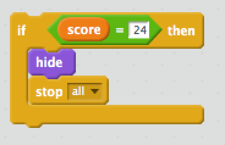

# Scratch on the Raspberry Pi

Scratch is a really fun visual programming language, developed by [MIT](enter-url-here) in the USA, allowing you to rapidly put together apps. It is included on the RPi by default. Scratch is specially designed to teach programming concepts to beginners, so if you found Python difficult to understand, Scratch could help clear things up a bit.

In this lesson we will teach you some Scratch. If you've done some before, then great — you can help with the learning process by helping out some of your classmates, or look up some more advanced exercises to try.

## Scratch basics

### Loading Scratch on the RPi

This is easy — You simply need to go to the main menu and choose "Programming > Scratch". The main UI should look something like this:

[INSERT SCREENSHOT SCRATCH 1.4 UI]

### Scratch main features

There are four main sections:

1. A window showing what the app you are putting together looks like — it should have a cat in it to start with. This is called the stage.
2. A list of the sprites (images) your app contains. Each character or object in your app will be represented by a sprite.
3. A list of different blocks that can be combined to make things happen in the app. Scratch calls these scripts, but I think blocks makes more sense.
4. A place to arrange the blocks in. We'll call this the work area.

You make things happen in Scratch by arranging the blocks together into flowcharts — you do this by dragging them to the work area, then clipping them together like Lego bricks. Instructions contained in the blocks run in order, from top to bottom.

### A simple example

1. First of all, go to the red "Events" option at the top of the list of blocks. Drag a "When flag clicked" block to the work area. Anything clipped on to the bottom of this will run as soon as the flag icon above the stage is clicked.
2. Next, go to the orange "Control" option at the top of the list of blocks. Drag a "Forever" block onto the work area and move it near the bottom of the previous block so it clips on to it. Anything we insert inside here will run forever, as soon as the flag icon is clicked. This is basically the same as when we put Python code inside a ```while True``` block:

```
while True:
  print("This runs forever")
```

3. Now drag two "repeat 10" blocks onto the work area, clipping them inside the "forever" block. Anything inside these will run 10 times, in the same way as Python ```for i in range()``` blocks:

```
for i in range(9):
  print("This runs 10 times")
```

4. Next, go back to the blue "Motion" option, and drag two "move 10 steps" onto the work area, putting each one inside a "repeat 10 times" block. click the number 10 and delete it, then type 3, so each one should read "move 3 steps" This causes our character to move a little tiny distance 20 times.

5. Now click the blue "Looks" tab, and drag two "next costume" blocks onto the work area, putting each one after a "repeat 3 times" block. Costumes are like frames of an animation — if you click the "Costumes" tab at the top of the block list, you'll see that the view shifts to show the different animation frames.  

6. Try running the code now by clicking the green flag icon. You'll see that character start to walk. Admittedly the animation is rubbish as we only have two sprites, but hey.

7. We have a problem — it works, but our cat tries to walk off the screen. We can fix this. Click back to the "Scripts" tab, go to the "Motion" option above the blocks list, then drag a "if on edge, bounce" block to the work area, putting it after the second "next costume" block. Now try it again!

8. We have another problem — when the cat bounces off the edge, he ends up upsidedown! This is because of his rotation options. To fix this, up where it shows "Sprite1" and its information, click the "only face left-right" button to make the rotation left/right-only.

Let's try one more thing before we move on:

1. Go to "Events" and drag a "when Sprite1 clicked" block onto the work area, in a different place to what you did before.
2. Go back to "Looks" and drag a "Say Hello! for 2 secs" block to the work area, clipping it onto the bottom of the previous block.
3. Change the time and message to whatever you want (nothing rude, please), and press the green flag. See what happens when you click the cat.

To save this work, choose "File > Save" from the Scratch menu, then go to a sensible place like Documents > scratch and save it as scratch-test.

Your final code blocks should look like this:


## A scratch breakout game

Now let's create something a bit more involved. We will create a simple breakout clone — the old fashioned game where you have a bat, and you've got to hit a ball upwards so it smashes the bricks or blocks, earning you points. If you miss the ball and it hits the bottom of the screen, you lose a life. There was also a famous version called Arkanoid, in the mid 1980s.


Let's get started!

First of all, create a new Scratch project ("File > New"), then save it as "scratch-arkanoid" ("File > Save", then enter "scratch-arkanoid" in the "New Filename" field, before pressing "OK").

### Creating the sprites and backgrounds

Let's put some backgrounds into our project:

1. First of all, delete the default cat sprite (hover over it, press the right mouse button, choose "Delete" from the pop up menu).
2. Now we need some backgrounds to represent the different states of the game. Click on the "Backgrounds" tab at the top of the screen, then click "Import". Choose "Nature > moon", then press OK.
3. Now do the same thing, but choose "stars" instead.
4. Press the "X" button to delete "background1" — we don't need it.
5. Press the "Copy" button next to the "stars" background twice, to make two copies of it.
6. Press the "Edit" button next to the "stars1" background. Use the "Text tool" to write some text on the screen along the lines of "You won!!". Choose a colour that will show up on the background, like white or yellow.
7. Do the same thing with the "stars2" background, except put a message on this background saying something similar to "Game over!!"

Now we need some sprites to act as the objects in our game.

1. From the buttons next to the "New sprite" text, click the "Paint new sprite" button. Draw a simple circle using the "Ellipse tool", making it not too big, and as round as possible. Again, choose a colour that will show up easily, like yellow.
2. Do the same thing, but this time draw a shortish line using the "Line tool", with a medium thickness Brush, in a different colour like light blue or white.
3. Draw a third sprite very similar to the second one, but a little bit shorter, and in a different colour like red. Make this one shorter but wider than the last one.

So these sprites will be our ball, bat, and bricks. Bear in mind that the smaller you make the sprites, the harder the game will be.

### Creating some variables

We need to create some variables to hold values used in our game.

1. Click the "Variables" option on the left hand side.
2. Click the "Make a variable" button, and enter a name "lives" for the first variable, pressing "OK" in the dialog box when you are done.
3. Do the same thing again, creating another variable called "score".
4. You'll see the two variables listed over to the left, and displayed in the game window.
5. Drag the "lives" and "score" boxes shown on the game window to somewhere suitable — the top left and right hand corners are good.

### Making our paddle move

Let's make our bat move!

To do so:

1. First make sure that "Sprite2" is selected, and the "Scripts" tab is selected at the top center of the window. This ensures that we are adding script to the bat, and not a different sprite.
2. Add blocks to the work area, just like so:


This means that when the flag is clicked, we:

1. Make sure the paddle is shown.
2. Set the y coordinate value of the bat to -165 (the centre of the game window is x 0, y 0).
3. Run a loop forever, which on each frame first sets the x coordinate of the bat to the x coordinate of the mouse pointer, then checks whether the bat is going off the screen on either side. If it is, we move it back, effectively meaning that it can't move off either edge.

### Making our ball move

Next, we want to make our ball move.

To do so:

1. Make sure "Sprite1" is selected.
2. Add blocks to the work area, just like so


This means that when the flag is clicked, we:

1. Place the ball at position 0,0 on the screen.
2. Point it 45 degrees, which means that it will travel up and to the right.
3. broadcast a message called "gameStart" — I'll explain this just below.
4. Make sure the ball is shown.
5. Set "score" to 0 and "lives" to 3.
6. Run a loop forever that checks if the ball has hit the edge of the screen — and bounces it off in the opposite direction if so — and moves the ball 10 pixels, on each frame.

We also need to add some script to the stage to respond to the "gameStart" message being broadcast.

To do so:

1. Click on the "Stage" item to the bottom right of the screen, to make sure you are adding script to the stage.
2. Add blocks to the work area, just like so:


This makes it so that when "gameStart" is broadcast, the "moon" background is shown. You can only change backgrounds in scripts attached to the Stage in Scratch 1.4.

### Making the ball bounce off the bat

Next, we need to make it so that the ball with bounce off the bat when they collide.

To do so:

1. Make sure "Sprite1" is selected.
2. Add blocks to the work area in a new place, like this:


3. Move the new set of blocks you've just created inside the existing "Forever" loop, just above the existing blocks.

This new bit of script causes a new check to be done each time the loop runs:

1. The game checks whether the ball (Sprite1) is touching the bat (Sprite2).
2. If so, we first check to see if the ball's direction is -135 degrees — travelling diagonally down to the left. If it is we rotate the ball's direction 90 degrees clockwise, so it starts travelling diagonally up to the left.
3. We then check whether the ball's direction is 135 degrees — travelling diagonally down to the right. If it is we rotate the ball's direction 90 degrees anticlockwise, so it starts travelling diagonally up to the right.

## Dealing with losing a life

When we fail to catch the ball with the bat, the game needs to respond by losing a life and letting us know about it! Let's deal with this next.

First of all, make sure you are on "Sprite1" (the ball), and add the following new block to your work area:


This does the following checks:

1. We check whether the ball has gone down below a y value of -150, meaning that it is basically hitting the bottom of the game area. If so, we take 1 off the value of "lives" variable, then run the rest of the checks.
2. If the "lives" variable has gone down to 0, the game is over, so we hide the ball and stop all scripts from running.
3. If not, we broadcast a message of "lifeLost", wait 1 second, show a "Ouch, you've lost a life" message, wait another second, show a "Get ready to go again!" message, then broadcast a "nextLife" message.
4. After that, we move the ball to position x 0, y 0, then point it in a direction of 45 degrees (diagonally up and to the right). The game loop now carries on and the player can have their next go.

Put this block just below the other outer if block inside the forever loop.

Next, we need to add some more code to the bat. select "Sprite2" to go to its work area.

Add the following new block to the work area:


This does the following:

1. It checks to see if the number of lives is 0.
2. If so, it broadcasts a "gameLost" message. It then waits 1 second, and stops all scripts from running. We wait one second because if we stop all the code running immediately, some of the code we want to run before the end of the game is stopped too!

Finally for this section, click the Stage and add the following three blocks to its work area:


So, here:

1. When the stage receives the "gameLost" message, we display the "stars2" background, which contains the "Game over!!"message.
2. When the stage receives the "lifeLost" message, we display the "stars" background while we display our life lost speech bubbles.
3. When the stage receives the "nextLife" message, we display the "moon" background again when the next life commences.

### Making the ball collide with the bricks

One major thing still missing is that the ball doesn't collide with the bricks — and we only have one brick!

Let's change this.

1. Click Sprite3 (our single brick) to make sure the next code we add is added to the brick's work area.
2. Adding the following new block to the work area:


This code does the following:

1. When the green flag is clicked, we first make sure the brick is showing on the screen.
2. Then we add a forever loop.
3. Inside this we check to see if the brick is touching "Sprite1" (the ball).
4. If so, we increase the score by 1 (each block is worth one point — change this if you wish), and broadcast a "ballCollide" event.

Now we need to duplicate the block many times, and add some more to the game. To duplicate a block:

1. Right click on "Sprite3".
2. Choose "duplicate" from the menu.
3. Place your new block in a sensible place on the game screen.

Make as many blocks as you like and make whatever pattern you like, but keep a record of how many blocks you make.

Now we need to move to the ball work area, and add some code there to respond to the "ballCollide" events — we need to make the ball change its course when it bounces!

1. Click the "Sprite1" (ball) sprite in the bottom right to make sure we add the next code to the ball work area.
2. Add the following code block:


### Winning the game

We have one more problem — we can't win the game! When all the bricks have been destroyed, the game keeps going forever until we die. Let's sort this out so we have a complete game.

1. Make sure you are on the "Sprite1" (ball) work area.
2. Add the following new code block, substituting your maximum score for 24 if you changed the points per block value in the previous section:



3. Add this block inside the existing "Forever" loop, just below the previous "If" block.

This block hides the ball and stops all ball code running.

Next, we'll add a new block to the bat work area:

1. Make sure you are on the "Sprite2" (bat) work area.
2. Add the following new code block, substituting your maximum score for 24 if you changed the points per block value in the previous section:


3. Add this block inside the existing "Forever" loop, just below the previous "If" block.

This block broadcasts a "gameWin" message, then waits one second, then stops all bat code running.

Finally, we need to add some code to the stage to react to the "gameWin" event:

1. Click on the "Stage" so we can see its work area.
2. Add a new block like so:


This simply shows the "You won!!" message when the "gameWin" message is broadcast.

### Extending the example

So that's it for the example, hope you enjoyed it.

This is a very simple version of breakout. There is only one level, no powerups, and the ball always travels at 45 degree angles.

If we had some more time, maybe we could extend the game to:

1. Have multiple levels.
2. Have multiple brick colours that are worth different points.
3. Have a splash screen at the start of the game, with a button that you press to start the actual game.
4. Have the ball moving at multiple different angles, depending on where along the bat it collides with it.

Above all, have fun.

## Physical computing with Scratch

There's another interesting thing about the RPi version of Scratch — It allows you to control the RPi's GPIO ports in the same way that we did with Python in our physical computing lessons!

Let's first go through a simple example to show how to recreate the simple LED demo we saw earlier on.

1. First, of all, wire up the simple LED circuit we showed you in the [physical computing lesson](get-the-exact-url).
2. Next, turn the Scratch GPIO server on — this is the application that runs in the background and communicates between scratch and the GPIO pins on the RPi. To do this, choose "Edit > Start GPIO server".
3. Now create a new Scratch project by choosing "File > New".
4. Drag a "when this sprite clicked" block to the work area (Events).
5. Drag a "broacast" block (Events) to the work area and clip it to the previous block. Change the text inside it to "gpio17on".
6. Drag a "wait 1 secs" block (Control) to the work area and clip it to the previous block.
5. Drag a "broacast" block (Events) to the work area and clip it to the previous block. Change the text inside it to "gpio17off".

Try clicking the cat and seeing what happens.


## (optional) Adding physical computing to the arkanoid/breakout game

If we still have time in the lesson, let's go back to our arkanoid/breakout game and see if we can add in some physical computing to our game. Maybe you could make the light flash on when a brick is destroyed? Or something else even more interesting?
